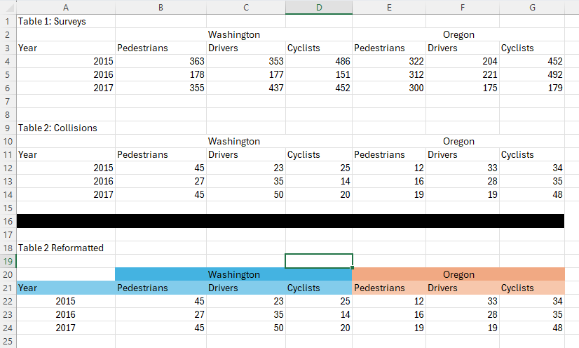
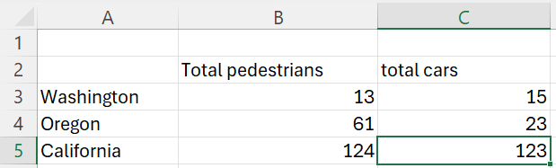

# Getting Started with Excelsior

``` r

library(excelsior)
```

### Overview

The excelsior package was developed to provide tools for working with
excel files in R.

## Importing from Excel

We often work with complex excel files that have formatting choices that
make sense for human use but not for machines. Here is a dummy example:

 We have several potential issues
with automation scripts that are supposed to work with this file.

- For each individual table, our headers are split across multiple rows,
  including merged cells.

- If each table is being updated each year with a new row of content
  (common situation for some of our projects), our scripts will break
  over time if they’re referencing absolute row numbers or cell ranges.
  If we wanted table 1 data, right now we could read in A4:G6, but next
  year we would need A4:G7. And for table 2, this year we need A12:G14,
  but next year we would presumably need A13:G16.

So that you can follow along, we have included this example file in this
package. Its filepath can be accessed with
`system.file("extdata", "example_workbook.xlsx", package = "excelsior")`

``` r

filepath <- system.file("extdata", "example_workbook.xlsx", package = "excelsior")
```

The example is in the first sheet, which has the default label of
“Sheet1”.

### Dealing with multi-tier headers

First, let’s assume we’re okay with absolute row numbers, and we just
want to read in table 1 such that the headers actually make sense.
[`read_excel_tiered_headers()`](https://cbedwards-dfw.github.io/excelsior/reference/read_excel_tiered_headers.md)
tackles this task.

First, here’s the problem we run into if we read the table in using
something like readxl:

``` r


data <- readxl::read_excel(filepath, sheet = "Sheet1", range = "A2:G6")
#> New names:
#> • `` -> `...1`
#> • `` -> `...3`
#> • `` -> `...4`
#> • `` -> `...6`
#> • `` -> `...7`

data
#> # A tibble: 4 × 7
#>   ...1  Washington  ...3    ...4     Oregon      ...6    ...7    
#>   <chr> <chr>       <chr>   <chr>    <chr>       <chr>   <chr>   
#> 1 Year  Pedestrians Drivers Cyclists Pedestrians Drivers Cyclists
#> 2 2015  363         353     486      322         204     452     
#> 3 2016  178         177     151      312         221     492     
#> 4 2017  355         437     452      300         175     179
```

Our column labels are no good. Most of them are blank, Washington and
Oregon are listed only for the first columns of the merged “Washington”
and “Oregon” columns, and the “pedestrians”, “drivers”, “cyclists”
information is not accessible in the column names. And because one of
our rows of labels is included in the data, all columns are characters,
even though our data is all numerics.

[`read_excel_tiered_headers()`](https://cbedwards-dfw.github.io/excelsior/reference/read_excel_tiered_headers.md)
fixes these problems.

``` r

data <- read_excel_tiered_headers(filepath, 
                                  sheet = "Sheet1",
                                  header_rows = 2:3,
                                  final_data_row = 6
)

data
#>   Year Washington_Pedestrians Washington_Drivers Washington_Cyclists
#> 4 2015                    363                353                 486
#> 5 2016                    178                177                 151
#> 6 2017                    355                437                 452
#>   Oregon_Pedestrians Oregon_Drivers Oregon_Cyclists  X
#> 4                322            204             452 NA
#> 5                312            221             492 NA
#> 6                300            175             179 NA
```

Let’s break that function call down. We need to specify the file
location and the sheet (as either the index number of the sheet or the
sheet name). The only other necessary part is providing the row numbers
of the header rows in argument `header_rows`. This must be a numeric
vector, but can include any number of rows and they don’t have to be
consecutive.

By default,
[`read_excel_tiered_headers()`](https://cbedwards-dfw.github.io/excelsior/reference/read_excel_tiered_headers.md)
assumes the data starts one row after the last header row and ends in
the last active row of the sheet. However, these can be specified
explicitly with `first_data_row` (useful if there is a vertical gap
between headers and data) and `last_data_row` (useful if there are
multiple tables on the sheet). Here we used `final_data_row = 6` since
we only want the contents of Table 1 rather than everything down to row
24. We’ll look at how to automatically determine row numbers in the next
section.

By default,
[`read_excel_tiered_headers()`](https://cbedwards-dfw.github.io/excelsior/reference/read_excel_tiered_headers.md)
assumes we want to pull all the active columns in the row range. We can
provide values for `first_column` and/or `final_column` (as numerics) to
constrain what is read in. In our example, there is a
formatted-but-empty cell in column H (the 8th column), hence our empty
`X` column in the resulting dataframe. We can fix this by including
`final_column = 7`:

``` r

data <- read_excel_tiered_headers(filepath, 
                                  sheet = "Sheet1",
                                  header_rows = 2:3,
                                  final_data_row = 6,
                                  final_column = 7
)

data
#>   Year Washington_Pedestrians Washington_Drivers Washington_Cyclists
#> 4 2015                    363                353                 486
#> 5 2016                    178                177                 151
#> 6 2017                    355                437                 452
#>   Oregon_Pedestrians Oregon_Drivers Oregon_Cyclists
#> 4                322            204             452
#> 5                312            221             492
#> 6                300            175             179
```

Finally, by default `read_excel_tiered_headers` combines the headers of
different rows with an underscore. However, if you want to use a
different character or characters to separate these, you can change that
behavior with the `sep` argument.

Our goal is to make the translation between excel and R as direct as
possible, so we do not attempt to change header capitalization. However,
if you want cleaner column labels where label separators are all
underscores and text is always lowercase, you easily achieve this by
piping the output of `read_excel_tierd_headers()` into
[`janitor::clean_names`](https://sfirke.github.io/janitor/reference/clean_names.html):

``` r

data <- read_excel_tiered_headers(filepath, 
                                  sheet = "Sheet1",
                                  header_rows = 2:3,
                                  final_data_row = 6,
                                  final_column = 7
) |> 
  janitor::clean_names()

data
#>   year washington_pedestrians washington_drivers washington_cyclists
#> 4 2015                    363                353                 486
#> 5 2016                    178                177                 151
#> 6 2017                    355                437                 452
#>   oregon_pedestrians oregon_drivers oregon_cyclists
#> 4                322            204             452
#> 5                312            221             492
#> 6                300            175             179
```

### Identifying rows via “anchor cells”

How can we write scripts to interact with multi-table worksheets in
which additional rows may be added over time? This is not a problem that
occurs when there is only one table in the worksheet, such that our
headers are on some fixed rows (e.g., 1, 2, and 3, or 2 and 3) and we
want to read everything down to the final row of the worksheet. However,
like in our example, we often encounter worksheets that are set up to
contain multiple tables stacked vertically. If additional rows may be
added to each table, we need to adaptively identify start and end rows
of each table.

The approach we take in `excelsior` is to focus on identifying “anchor
cells” which serve as landmarks to identify individual tables or
sections of the worksheet. We have two ways to find anchor cells. The
first is based on the contents of the anchor cell; commonly this will be
a table name (e.g., “Table 2: Collisions”) or other metadata text, or it
could be a column header (e.g., “Year”).
[`row_finder()`](https://cbedwards-dfw.github.io/excelsior/reference/row_finder.md)
can tackle these problems. The second method is to identify the anchor
cell by *fill color*. This is probably niche, but we work with several
files that use bars of black-filled cells to distinguish sections.
[`row_finder_by_color()`](https://cbedwards-dfw.github.io/excelsior/reference/row_finder_by_color.md)
can tackle this case.

Our functions presume that columns are not removed or added, just that
rows might be, so we can specify the column of the anchor cell, and then
our functions can find the correct rows.

#### `row_finder()`

Let’s say we want to programmatically read in table 2 in our example.
Right now the headers start on row 10 and the data ends on row 14. We
want to identify the start and end rows based on the table’s location in
the sheet, which right now should give us those same row numbers of 10
and 14.

A good anchor cell for the start of table 2 would be the table header,
“Table 2: Collisions”. Here’s how we find that:

``` r

table_2_start_row <- row_finder(filepath,
                                sheet = "Sheet1",
                                column = 1, 
                                pattern = "Table 2: Collisions")
table_2_start_row
#> [1] 9
```

Let’s break that down. After identifying the file and the sheet, we told
`row_finder` what column to look in, and then gave it a text pattern
with the `pattern` argument.

(Pro tip: the `pattern` argument handles regular expressions, so you can
do more complicated things like “cell that starts with Table 2”,
`"^Table 2"`, or any other regular expression tricks.)

However, our table doesn’t necessarily start on the row of the anchor
cell – the cell is just a convenient way to generally locate the table.
In our case, the table starts one row after the anchor cell. We can do
some arithmetic after the fact, e.g., read in starting from row
`table_2_start_row + 1`. For simplicity, though,
[`row_finder()`](https://cbedwards-dfw.github.io/excelsior/reference/row_finder.md)
has an optional argument `offset`.
[`row_finder()`](https://cbedwards-dfw.github.io/excelsior/reference/row_finder.md)
will add or subtract the `offset` value from whatever row the anchor
cell is on. So here, we could use

``` r

table_2_start_row <- row_finder(filepath,
                                sheet = "Sheet1",
                                column = 1, 
                                pattern = "Table 2",
                                offset = 1)
table_2_start_row
#> [1] 10
```

What if we didn’t have table headers, though? We might want to use
“Year” as our anchor cell. But we run into a problem: “Year” already
occurs earlier in Column A, on row 3:

``` r

row_finder(filepath,
           sheet = "Sheet1",
           column = 1, 
           pattern = "Year")
#> [1] 3
```

The optional argument `instance` lets us use anchor patterns in which
more than one cell in the column matches. By default `row_finder` has
`instance = 1`, so it will return the first cell that matches the
pattern. We can get the second instance of “Year” with

``` r

row_finder(filepath,
           sheet = "Sheet1",
           column = 1, 
           pattern = "Year",
           instance = 2)
#> [1] 11
```

And then if we were using this to identify the start of the table, we
would want to add `offset = -1`, since the table starts one row above
the anchor cell.

#### `row_finder_by_color`

How would we identify the bottom of Table 2? One option would be to use
`row_finder` with anchor cells from the third table chunk (“Table 2
Reformatted”) and appropriate offsetting. E.g.,

``` r

row_finder(filepath,
           sheet = "Sheet1",
           column = 1, 
           pattern = "Table 2 Reformatted",
           instance = 1,
           offset = -4)
#> [1] 14
```

An alternative that can be more useful in some cases is to identify the
first (or nth) instance of a cell with a specified fill color. In our
example, we can identify the black-filled row programmatically.

First, it’s helpful to know the fill color of a cell in R hex terms. The
function
[`find_fill_color()`](https://cbedwards-dfw.github.io/excelsior/reference/find_fill_color.md)
does this for us. Let’s find the fill of the current A16 cell.

``` r

find_fill_color(filepath,
           sheet = "Sheet1",
           address = "A16")
#> [1] "FF000000"
```

So now we know we want to find cells with a fill of “FF000000”. Note
that we don’t want to use
[`find_fill_color()`](https://cbedwards-dfw.github.io/excelsior/reference/find_fill_color.md)
programmatically within our scripts (e.g.,
`target_color = find_fill_color(filepath, sheet = "Sheet1", address = "A16")`,
since we’re assuming that the contents may shift rows, such that “A16”
may not be the black-filled row in the future.

[`row_finder_by_color()`](https://cbedwards-dfw.github.io/excelsior/reference/row_finder_by_color.md)
works the same as `row_finder`, except that instead of `pattern` we give
`color`.

``` r

row_finder_by_color(filepath,
           sheet = "Sheet1",
           column = 1, 
           color = "FF000000")
#> [1] 16
```

We can also specify `instance` (defaults to `1`) or `offset` (defaults
to `0`). For this case, we might use an offset of -2, which would give
us the bottom of table 2 (row 14):

``` r

row_finder_by_color(filepath,
           sheet = "Sheet1",
           column = 1, 
           color = "FF000000",
           offset = -2)
#> [1] 14
```

### Putting it all together

Let’s combine what we’ve learned to read in and parse table 2
programmatically so that adding rows to table 2 or previous tables
doesn’t mess things up. We already know the first two rows of the table
are header; we’ll assume that’s not going to change.

``` r

## find start of table based on table header
table_2_start_row <- row_finder(filepath,
                                sheet = "Sheet1",
                                column = 1, 
                                pattern = "Table 2",
                                offset = 1)

## find end of table based on row of black-filled cells
table_2_end_row <- row_finder_by_color(filepath,
           sheet = "Sheet1",
           column = 1, 
           color = "FF000000",
           offset = -2)

## read in the table, handling multi-tiered headers appropriately
table_2 <- read_excel_tiered_headers(filepath,
                                     sheet = "Sheet1", 
                                     header_rows = table_2_start_row:(table_2_start_row + 1), 
                                     final_data_row = table_2_end_row,
                                     final_column = 7
                                    )

table_2
#>    Year Washington_Pedestrians Washington_Drivers Washington_Cyclists
#> 12 2015                     45                 23                  25
#> 13 2016                     27                 35                  14
#> 14 2017                     45                 50                  20
#>    Oregon_Pedestrians Oregon_Drivers Oregon_Cyclists
#> 12                 12             33              34
#> 13                 16             28              35
#> 14                 19             19              48
```

You can test if this works correctly by making a copy of the excel file
and adding additional rows above table 2 and adding additional data rows
*to* table 2. The code above should still correctly read in all of the
table (although you’ll need to update the `filepath` variable to point
to your new copy of the file.

#### Caution

One word of warning: sometimes users may change the number of empty
buffer rows around a table. This can make relying on offsets a little
sketchy. For example, what if a user added an additional row of data for
table 2 in row 15, but didn’t move the black bar down. Our code above
would skip the data in row 15. (You can try this with a copy of the
spreadsheet).

A safer approach if you’re uncertain of if the number of empty buffer
rows may change is to be more inclusive with the rows you read in, and
then afterwards remove rows that are all NAs or for which the first
column is an NA. Here’s an example of that, in which I am more
conservative with handling the buffers around the black bar.

``` r


table_2_end_row <- row_finder_by_color(filepath,
           sheet = "Sheet1",
           column = 1, 
           color = "FF000000",
           offset = 0) ## THIS IS NOW GRABBING THE BLACK BAR ROW ITSELF

table_2 <- read_excel_tiered_headers(filepath,
                                     sheet = "Sheet1", 
                                     header_rows = table_2_start_row:(table_2_start_row + 1), 
                                     final_data_row = table_2_end_row,
                                     final_column = 7
                                    )

table_2
#>    Year Washington_Pedestrians Washington_Drivers Washington_Cyclists
#> 12 2015                     45                 23                  25
#> 13 2016                     27                 35                  14
#> 14 2017                     45                 50                  20
#> 15   NA                     NA                 NA                  NA
#> 16   NA                     NA                 NA                  NA
#>    Oregon_Pedestrians Oregon_Drivers Oregon_Cyclists
#> 12                 12             33              34
#> 13                 16             28              35
#> 14                 19             19              48
#> 15                 NA             NA              NA
#> 16                 NA             NA              NA
```

We now have several rows of NAs. We know we got all the data, but it’d
be nice to not have those extra rows.

One option: use only rows in which the entry in the “Year” column is not
an NA:

``` r

table_2 |> 
  dplyr::filter(!is.na(Year))
#>   Year Washington_Pedestrians Washington_Drivers Washington_Cyclists
#> 1 2015                     45                 23                  25
#> 2 2016                     27                 35                  14
#> 3 2017                     45                 50                  20
#>   Oregon_Pedestrians Oregon_Drivers Oregon_Cyclists
#> 1                 12             33              34
#> 2                 16             28              35
#> 3                 19             19              48
```

In this example, option 1 works great. However, what if the data
sometimes contains “natural” NAs in our columns? Another option is to
remove any rows that contain *only* NAs:

``` r

only_nas <- apply(table_2, 1, function(x){all(is.na(x))})
only_nas
#>    12    13    14    15    16 
#> FALSE FALSE FALSE  TRUE  TRUE

table_2[!only_nas, ]
#>    Year Washington_Pedestrians Washington_Drivers Washington_Cyclists
#> 12 2015                     45                 23                  25
#> 13 2016                     27                 35                  14
#> 14 2017                     45                 50                  20
#>    Oregon_Pedestrians Oregon_Drivers Oregon_Cyclists
#> 12                 12             33              34
#> 13                 16             28              35
#> 14                 19             19              48
```

## Helper functions

We have several helpful functions for working with excel files.

### I need to replicate contents from an excel file into an R script

[`clip_to_vec()`](https://cbedwards-dfw.github.io/excelsior/reference/clip_to_vec.md)
takes a row or column that’s been copied to your system clipboard and
replaces the system clipboard to the R code needed to recreate that
row/column as vector. For example, if I select the “Pedestrians” column
in Table 1 (B4:B6) and copy (e.g., ctrl-c), then run
[`clip_to_vec()`](https://cbedwards-dfw.github.io/excelsior/reference/clip_to_vec.md)
in R, when I go to paste (e.g., ctrl-v), I get the following:

> > c(363, 178, 355)

This is mostly helpful if you want to hard code something in R based on
the contents of an excel file.

### Help, the numeric contents I read in from excel have a weird mix of formatting!

This is especially common if different rows have different types of
content (e.g., a mix of percents and numbers), since R will assign a
single format to an entire column.

[`as_numeric_smart()`](https://cbedwards-dfw.github.io/excelsior/reference/as_numeric_smart.md)
takes a character vector that you want to be numeric, and (a) removes
commas, (b) converts percentages to proportions, and (c) converts actual
text to NAs.

``` r

original_column = c("1,000", "10%", "5.5", "missing")
as_numeric_smart(original_column)
#> [1] 1000.0    0.1    5.5     NA
```

## Exporting to Excel / Copying between Excel

We sometimes need to add a dataframe from R into an excel file, or
transfer parts of a sheet from one file to another programmatically. The
functions in this section help with that. They all work with `openxlsx2`
workbook objects, so you will need to load in excel files as workbook
objects with `openxslx2::wb_load()` and save your results afterwards
with
[`openxlsx2::wb_save()`](https://janmarvin.github.io/openxlsx2/reference/wb_save.html).
For more information on the `openxlsx2` package, see
<https://janmarvin.github.io/openxlsx2/>.

### Dataframe into Excel

[`implant_df()`](https://cbedwards-dfw.github.io/excelsior/reference/implant_df.md)
pops a dataframe into an openxlsx2 workbook. This is similar to
[`openxlsx2::wb_add_data()`](https://janmarvin.github.io/openxlsx2/reference/wb_add_data.html),
but (a) includes a debug mode that instead colors the cells that would
be updated, making it easy to confirm that you’re placing the dataframe
in the right place, and (b) by default converts the dataframe contents
to numerics when appropriate using
[`as_numeric_smart()`](https://cbedwards-dfw.github.io/excelsior/reference/as_numeric_smart.md).
Think of this as just a handy advanced version of `wb_add_data()`

### Copying contents safely

[`copy_section()`](https://cbedwards-dfw.github.io/excelsior/reference/copy_section.md)
copies part of a sheet into a workbook. This is basically a way to say
“Copy C3:D4 from sheet 1 to E5:F6 of sheet 2”, but with some important
safety features to avoid mistaken behavior if aspects of the sheet
change. This was developed for working with complex annual files, in
which we might want to copy values from a template file into the same
set of cells of a new annual file, but we need to be sure that the shape
of the files didn’t change. The function allows defining reference
columns or headers by offset.

As an example, imagine we are want to copy the numbers of B3:C5 from the
following into a different sheet or workbook:



And what if we don’t trust that the order of Washington, Oregon, and
California will be kept consistent between years? Or we think it’s
possible that users would have added a new “notes” column between total
pedestrians and total cars. Normally we might just copy in the row and
column headers to be safe. But if we’re copying the contents into a
sheet with address-based formulas that treat Washington and Oregon
values differently, it’s not enough to make sure the state labels are
correct in the resulting sheet – we need to have an error pop up if
they’ve been re-arranged.

optional arguments `check_col_offset` and `check_row_offset` provide
solutions to this problem. `check_col_offset` allows the user to specify
a reference column that should match between the copy-from and copy-to
sheets. If we set `check_col_offset = 1`,
[`copy_section()`](https://cbedwards-dfw.github.io/excelsior/reference/copy_section.md)
will make sure that the column just to the left of the copy-from block
exactly matches the left the column just to the left of the copy-to
block. `check_row_offset()` does the same thing, but compares reference
rows (e.g., making sure the headers exactly match). In our example, we
would use `from_address = "B3:C5"`, `check_row_offset = 1` (row above
the copied data show match) and `check_col_offset = 1` (column to the
left of the copied data should match).

For speed purposes,
[`copy_section()`](https://cbedwards-dfw.github.io/excelsior/reference/copy_section.md)
actually uses a dataframe as the copy-from object, with the expectation
that that dataframe will be a complete read-in of an excel sheet. So
it’s copying *from* a dataframe *into* an openxlsx2 workbook, but with
the expected use case of intending to copy contents from one
workbook/worksheet to another.

### Update columns from one file to another

We sometimes have template files that we share with multiple groups,
each of which is responsible for updating values of some parts of some
sheet (this is a common workflow for the Salmon Technical Team of the
Pacific Salmon Commission).
[`copy_columns()`](https://cbedwards-dfw.github.io/excelsior/reference/copy_columns.md)
streamlines aggregating the contents from multiple files into a single
file. In addition to copying contents, it also highlights the cells that
were copied, doing so with different colors for cases when the values
did or did not change relative to the original file.
